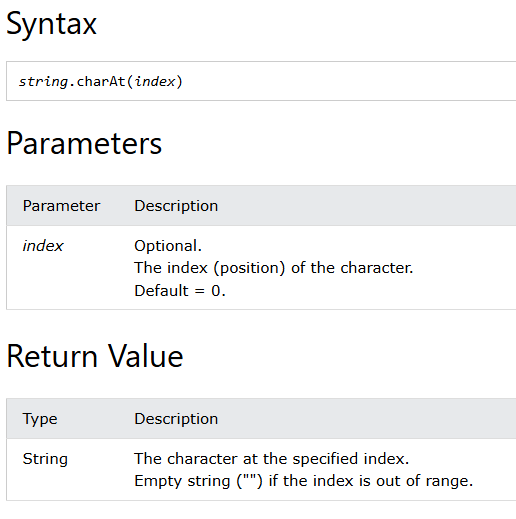
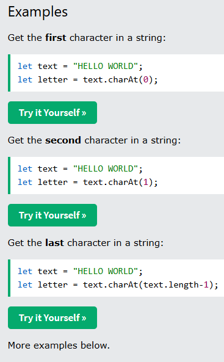
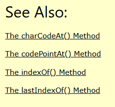

# Level 1 README
1. from [w3s](https://www.w3schools.com) simplified.
1. from [MDN](https://developer.mozilla.org/en-US/) simplified.

## charAt()
- [W3 Schools jsref charAt](https://www.w3schools.com/jsref/jsref_charat.asp)
- [MDN String.charAt](https://developer.mozilla.org/en-US/docs/Web/JavaScript/Reference/Global_Objects/String/charAt)

## from w3s




## String.prototype.charAt() - MDN

The **`charAt()`** method returns a new string consisting of the single UTF-16 code unit at the given index.


```js interactive-example
const sentence = "The quick brown fox jumps over the lazy dog.";

const index = 4;

console.log(`The character at index ${index} is ${sentence.charAt(index)}`);
// Expected output: "The character at index 4 is q"
```

## Syntax

```js-nolint
charAt(index)
```

### Parameters

- `index`
  - : Zero-based index of the character to be returned. [Converted to an integer](/en-US/docs/Web/JavaScript/Reference/Global_Objects/Number#integer_conversion) — `undefined` is converted to 0.

### Return value

A string representing the character (exactly one UTF-16 code unit) at the specified `index`. If `index` is out of the range of `0` – `str.length - 1`, `charAt()` returns an empty string.

## Description

Characters in a string are indexed from left to right. The index of the first character is `0`, and the index of the last character in a string called `str` is `str.length - 1`.


`charAt()` is very similar to using [bracket notation](/en-US/docs/Web/JavaScript/Reference/Operators/Property_accessors#bracket_notation) to access a character at the specified index. The main differences are:

- `charAt()` attempts to convert `index` to an integer, while bracket notation does not, and directly uses `index` as a property name.
- `charAt()` returns an empty string if `index` is out of range, while bracket notation returns `undefined`.

## Examples

### Using charAt()

The following example displays characters at different locations in the string `"Brave new world"`:

```js
const anyString = "Brave new world";
console.log(`The character at index 0   is '${anyString.charAt()}'`);
// No index was provided, used 0 as default

console.log(`The character at index 0   is '${anyString.charAt(0)}'`);
console.log(`The character at index 1   is '${anyString.charAt(1)}'`);
console.log(`The character at index 2   is '${anyString.charAt(2)}'`);
console.log(`The character at index 3   is '${anyString.charAt(3)}'`);
console.log(`The character at index 4   is '${anyString.charAt(4)}'`);
console.log(`The character at index 999 is '${anyString.charAt(999)}'`);
```

These lines display the following:

```plain
The character at index 0   is 'B'

The character at index 0   is 'B'
The character at index 1   is 'r'
The character at index 2   is 'a'
The character at index 3   is 'v'
The character at index 4   is 'e'
The character at index 999 is ''
```


## Specifications

{{Specifications}}


- [JavaScript has a Unicode problem](https://mathiasbynens.be/notes/javascript-unicode) by Mathias Bynens (2013)

## Object.entries()

## Array.indexOf()

## Object.keys()

## Array.lastIndexOf()

## Math.max()

## Math.min()

## repeat()

## Array.slice()

## String.includes()

## string.indexOf()

## string.lastIndexOf()

## Object.values()
