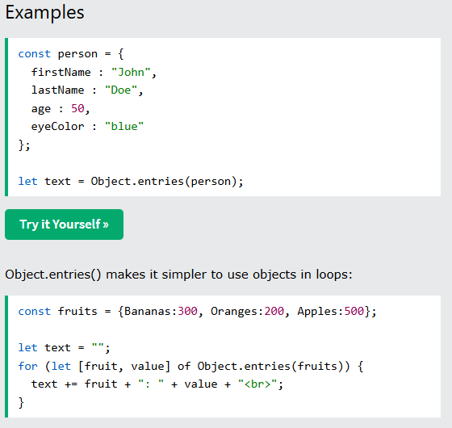
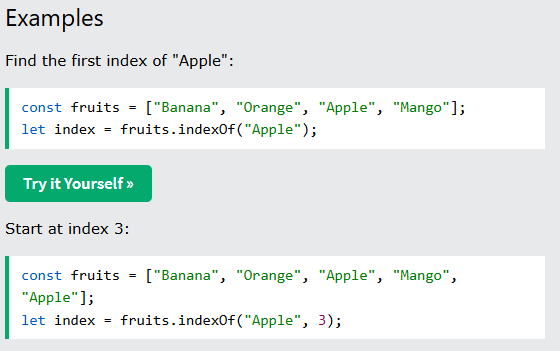
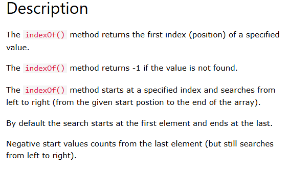

# Level 1 README
1. from [w3s](https://www.w3schools.com) simplified.
1. from [MDN](https://developer.mozilla.org/en-US/) simplified.

## charAt()
- [W3 Schools jsref charAt](https://www.w3schools.com/jsref/jsref_charat.asp)
- [MDN String.charAt](https://developer.mozilla.org/en-US/docs/Web/JavaScript/Reference/Global_Objects/String/charAt)

## from w3s


## String.prototype.charAt() - MDN

The **`charAt()`** method returns a new string consisting of the single UTF-16 code unit at the given index.


```js interactive-example
const sentence = "The quick brown fox jumps over the lazy dog.";

const index = 4;

console.log(`The character at index ${index} is ${sentence.charAt(index)}`);
// Expected output: "The character at index 4 is q"
```

## Syntax

```js-nolint
charAt(index)
```

### Parameters

- `index`
  - : Zero-based index of the character to be returned. [Converted to an integer](/en-US/docs/Web/JavaScript/Reference/Global_Objects/Number#integer_conversion) — `undefined` is converted to 0.

### Return value

A string representing the character (exactly one UTF-16 code unit) at the specified `index`. If `index` is out of the range of `0` – `str.length - 1`, `charAt()` returns an empty string.

## Description

Characters in a string are indexed from left to right. The index of the first character is `0`, and the index of the last character in a string called `str` is `str.length - 1`.


`charAt()` is very similar to using [bracket notation](/en-US/docs/Web/JavaScript/Reference/Operators/Property_accessors#bracket_notation) to access a character at the specified index. The main differences are:

- `charAt()` attempts to convert `index` to an integer, while bracket notation does not, and directly uses `index` as a property name.
- `charAt()` returns an empty string if `index` is out of range, while bracket notation returns `undefined`.

## Examples

### Using charAt()

The following example displays characters at different locations in the string `"Brave new world"`:

```js
const anyString = "Brave new world";
console.log(`The character at index 0   is '${anyString.charAt()}'`);
// No index was provided, used 0 as default

console.log(`The character at index 0   is '${anyString.charAt(0)}'`);
console.log(`The character at index 1   is '${anyString.charAt(1)}'`);
console.log(`The character at index 2   is '${anyString.charAt(2)}'`);
console.log(`The character at index 3   is '${anyString.charAt(3)}'`);
console.log(`The character at index 4   is '${anyString.charAt(4)}'`);
console.log(`The character at index 999 is '${anyString.charAt(999)}'`);
```

These lines display the following:

```plain
The character at index 0   is 'B'

The character at index 0   is 'B'
The character at index 1   is 'r'
The character at index 2   is 'a'
The character at index 3   is 'v'
The character at index 4   is 'e'
The character at index 999 is ''
```


## Specifications

{{Specifications}}


- [JavaScript has a Unicode problem](https://mathiasbynens.be/notes/javascript-unicode) by Mathias Bynens (2013)

## Object.entries()

### From W3S
1. 
1. 
1. 
1. 

### From MDN Object.entries()
The **`Object.entries()`** static method returns an array of a given object's own enumerable string-keyed property key-value pairs.

{{InteractiveExample("JavaScript Demo: Object.entries()")}}

```js interactive-example
const object1 = {
  a: "some string",
  b: 42,
};

for (const [key, value] of Object.entries(object1)) {
  console.log(`${key}: ${value}`);
}

// Expected output:
// "a: some string"
// "b: 42"
```

## Syntax

```js-nolint
Object.entries(obj)
```

### Parameters

- `obj`
  - : An object.

### Return value

An array of the given object's own enumerable string-keyed property key-value pairs. Each key-value pair is an array with two elements: the first element is the property key (which is always a string), and the second element is the property value.

## Description

`Object.entries()` returns an array whose elements are arrays corresponding to the enumerable string-keyed property key-value pairs found directly upon `object`. 

If you only need the property keys, use {{jsxref("Object.keys()")}} instead. If you only need the property values, use {{jsxref("Object.values()")}} instead.

## Examples

### Using Object.entries()

```js
const obj = { foo: "bar", baz: 42 };
console.log(Object.entries(obj)); // [ ['foo', 'bar'], ['baz', 42] ]

const arrayLike = { 0: "a", 1: "b", 2: "c" };
console.log(Object.entries(arrayLike)); // [ ['0', 'a'], ['1', 'b'], ['2', 'c'] ]
```

### Iterating through an Object

Using [array destructuring](/en-US/docs/Web/JavaScript/Reference/Operators/Destructuring#array_destructuring), you can iterate through objects easily.

```js
// Using for...of loop
const obj = { a: 5, b: 7, c: 9 };
for (const [key, value] of Object.entries(obj)) {
  console.log(`${key} ${value}`); // "a 5", "b 7", "c 9"
}

// Using array methods
Object.entries(obj).forEach(([key, value]) => {
  console.log(`${key} ${value}`); // "a 5", "b 7", "c 9"
});
```


## Array.indexOf() from W3S
1. 
1. 
1. 
1. 

## Array.prototype.indexOf() from MDN
The **`indexOf()`** method of {{jsxref("Array")}} instances returns the first index at which a
given element can be found in the array, or -1 if it is not present.

{{InteractiveExample("JavaScript Demo: Array.prototype.indexOf()")}}

```js interactive-example
const beasts = ["ant", "bison", "camel", "duck", "bison"];

console.log(beasts.indexOf("bison"));
// Expected output: 1

// Start from index 2
console.log(beasts.indexOf("bison", 2));
// Expected output: 4

console.log(beasts.indexOf("giraffe"));
// Expected output: -1
```

## Syntax

```js-nolint
indexOf(searchElement)
indexOf(searchElement, fromIndex)
```

### Parameters

- `searchElement`
  - : Element to locate in the array.
- `fromIndex` {{optional_inline}}
  - : Zero-based index at which to start searching, [converted to an integer](/en-US/docs/Web/JavaScript/Reference/Global_Objects/Number#integer_conversion).
    - Negative index counts back from the end of the array — if `-array.length <= fromIndex < 0`, `fromIndex + array.length` is used. Note, the array is still searched from front to back in this case.
    - If `fromIndex < -array.length` or `fromIndex` is omitted, `0` is used, causing the entire array to be searched.
    - If `fromIndex >= array.length`, the array is not searched and `-1` is returned.

### Return value

The first index of `searchElement` in the array; `-1` if not found.

## Description

The `indexOf()` method compares `searchElement` to elements of the array using [strict equality](/en-US/docs/Web/JavaScript/Reference/Operators/Strict_equality) (the same algorithm used by the `===` operator). [`NaN`](/en-US/docs/Web/JavaScript/Reference/Global_Objects/NaN) values are never compared as equal, so `indexOf()` always returns `-1` when `searchElement` is `NaN`.

## Examples

### Using indexOf()

The following example uses `indexOf()` to locate values in an array.

```js
const array = [2, 9, 9];
array.indexOf(2); // 0
array.indexOf(7); // -1
array.indexOf(9, 2); // 2
array.indexOf(2, -1); // -1
array.indexOf(2, -3); // 0
```

You cannot use `indexOf()` to search for `NaN`.

```js
const array = [NaN];
array.indexOf(NaN); // -1
```

### Finding all the occurrences of an element

```js
const indices = [];
const array = ["a", "b", "a", "c", "a", "d"];
const element = "a";
let idx = array.indexOf(element);
while (idx !== -1) {
  indices.push(idx);
  idx = array.indexOf(element, idx + 1);
}
console.log(indices);
// [0, 2, 4]
```


## Object.keys()

## Array.lastIndexOf()

## Math.max()

## Math.min()

## repeat()

## Array.slice()

## String.includes()

## string.indexOf()

## string.lastIndexOf()

## Object.values()
